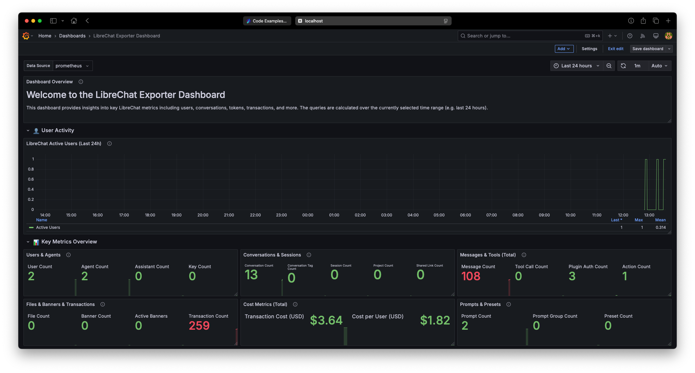
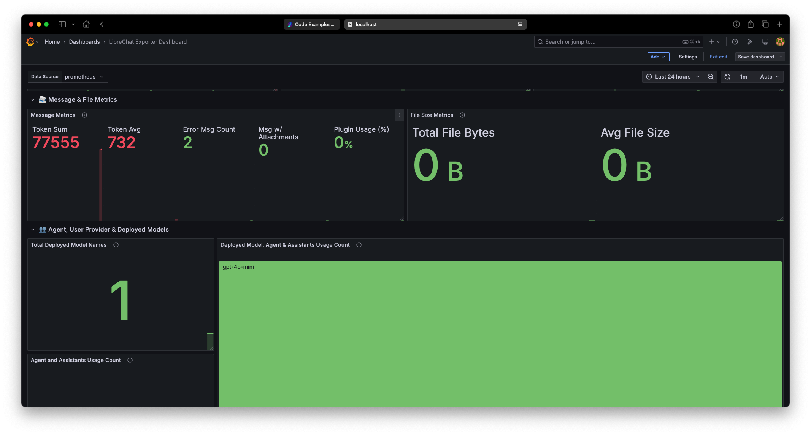
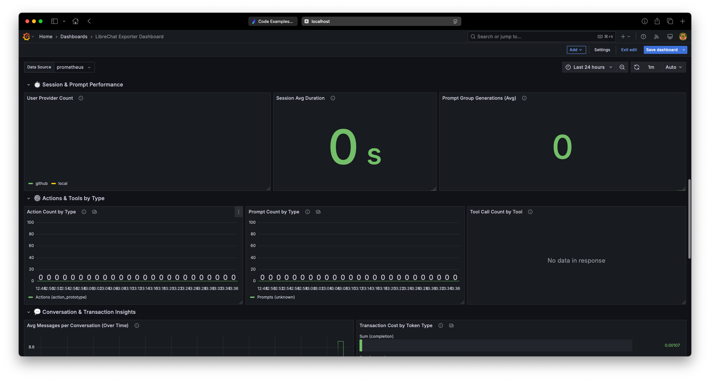
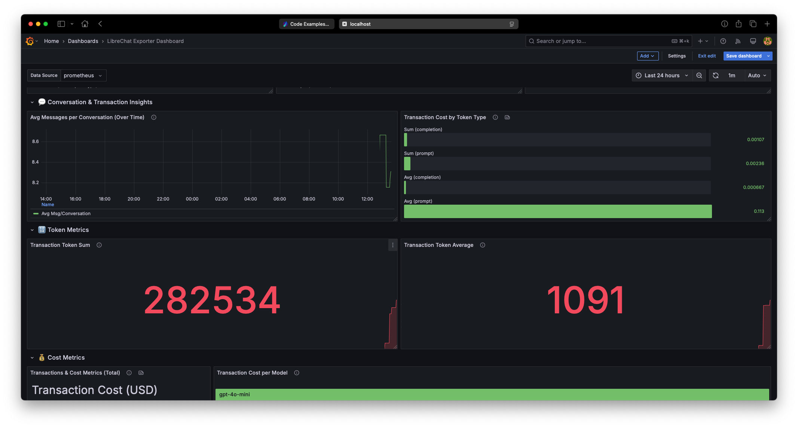
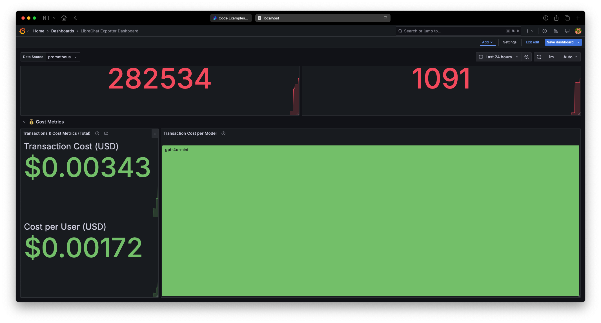

# LibreChat Prometheus Exporter

Welcome to the **LibreChat Prometheus Exporter** repository! This project provides a lightweight Node.js service (built with **Express**, **Mongoose**, and **prom-client**) that connects to your LibreChat MongoDB database, collects useful metrics, and exposes them on a `/metrics` endpoint. You can then configure **Prometheus** to scrape these metrics and visualize them using tools like **Grafana**.

## Table of Contents

1. [Features](#features)
2. [Prerequisites](#prerequisites)
3. [Installation & Setup](#installation--setup)
   - [Local Setup](#local-setup)
   - [Docker Setup](#docker-setup)
4. [Environment Variables](#environment-variables)
5. [Usage](#usage)
6. [Prometheus & Grafana Configuration](#prometheus--grafana-configuration)
7. [Dashboard Example](#dashboard-example)
8. [Dashboard Screenshots](#dashboard-screenshots)
9. [Project Structure](#project-structure)
10. [Contributing](#contributing)
11. [License](#license)


## Features

- **Basic Metrics**: Collects counts of users, messages, conversations, tools, and more from the LibreChat MongoDB database.
- **Advanced Metrics**: Tracks average token usage, error messages, plugin usage, file size stats, transaction costs, cost per user/model, agent usage, session duration, and more.
- **Prometheus Integration**: Exposes a `/metrics` endpoint that Prometheus can scrape.
- **Grafana Dashboard**: Provides an example dashboard configuration (JSON) for visualizing metrics (see [Dashboard Example](#dashboard-example)).


## Prerequisites

1. **Node.js** (version 22.x or later recommended)
2. **MongoDB** (the LibreChat database)
3. **Docker** (optional but recommended for running in a container)
4. **Prometheus** (for metric scraping)
5. **Grafana** (for visualization, optional but highly recommended)


## Installation & Setup

You can run the exporter either locally using Node.js or inside a Docker container. Below are the instructions for both methods.

### Local Setup

1. **Clone the repository**:
   ```bash
   git clone https://github.com/rubentalstra/librechat-prom-exporter.git
   cd librechat-prom-exporter
   ```

2. **Install dependencies**:
   ```bash
   npm install
   ```

3. **Set environment variables**:  
   An example file `.env.example` is provided in the project root. Copy this file to a new `.env` file and update it with your specific settings:
   ```bash
   cp .env.example .env
   ```
   Alternatively, set the environment variables in your shell (see the [Environment Variables](#environment-variables) section).

4. **Build the project**:
   ```bash
   npm run build
   ```

5. **Run the exporter**:
   ```bash
   npm run start
   ```
   The exporter should now be running on the configured port (default `9087`).

### Docker Setup

This setup uses the prebuilt **LibreChat Prometheus Exporter** image from GitHub Container Registry, so there’s no need to build the container locally.

1. **Set environment variables**:  
   Copy `.env.example` to `.env` in the same directory as the `docker-compose.yml`:
   ```bash
   cp .env.example .env
   ```

2. **Run Docker Compose**:
   ```bash
   docker-compose up -d
   ```
   - This will pull the latest `ghcr.io/rubentalstra/librechat-prom-exporter:latest` image for the exporter service.
   - It will also spin up a Prometheus container based on the configuration in `docker-compose.yml`.

3. The exporter container should now be exposing metrics on `http://localhost:9087/metrics` (or your chosen port).


## Environment Variables

The following environment variables can be configured via the `.env` file (or your shell environment). Use the provided `.env.example` as a starting point.

| Variable    | Default                                          | Description                                                    |
|-------------|--------------------------------------------------|----------------------------------------------------------------|
| `MONGO_URI` | `mongodb://host.docker.internal:27017/librechat` | The connection string for your LibreChat MongoDB database.     |
| `PORT`      | `9087`                                           | The port on which the exporter will run and expose `/metrics`. |

Example `.env` file (generated by copying `.env.example`):
```
MONGO_URI=mongodb://my-mongo-host:27017/librechat
PORT=9087
```


## Usage

Once running, the service will connect to your LibreChat MongoDB database, gather metrics, and expose them on:

```
GET /metrics
```

Point your Prometheus server to scrape this endpoint at regular intervals (e.g., every 15s or 30s). For example, in your `prometheus.yml`:

```yaml
global:
   scrape_interval: 15s

scrape_configs:
   - job_name: 'librechat-exporter'
     static_configs:
        - targets: ['exporter:9087']
```


## Prometheus & Grafana Configuration

1. **Prometheus**:
   - Ensure your `prometheus.yml` includes the `scrape_configs` pointing to the exporter.
   - Example:
     ```yaml
     global:
         scrape_interval: 15s
     
     scrape_configs:
         - job_name: 'librechat-exporter'
           static_configs:
               - targets: ['exporter:9087']
     ```

2. **Grafana**:
   - Create a new dashboard or import the provided JSON file (`librechat-exporter-dashboard.json`) found in the repository.
   - Set the data source to your Prometheus instance.
   - You will then see panels for user counts, message stats, transaction costs, and more.


## Dashboard Example

The repository contains a sample **Grafana Dashboard** JSON (`librechat-exporter-dashboard.json`) which includes:

- **User Activity** (active users, user provider distribution)
- **Key Metrics Overview** (counts for users, messages, conversations, etc.)
- **Message & File Metrics** (token usage, plugin usage, file sizes)
- **Session & Prompt Performance** (average session duration, prompt group generations)
- **Actions & Tools by Type** (bar charts for action and prompt counts, tool call usage)
- **Conversation & Transaction Insights** (average messages per conversation, transaction cost breakdown, token sums)

Import this file directly into Grafana to get a comprehensive overview of your LibreChat metrics.


## Dashboard Screenshots

Below are sample screenshots from the **LibreChat Exporter Dashboard**. These images (screenshots 1-5) illustrate various panels and insights provided by the dashboard.

1. **Dashboard Overview**  
   
   
   
   
   

---

## Project Structure

```
librechat-prom-exporter/
├── src/
│   ├── metrics/                
│   │   ├── advancedMetrics.ts  # Contains advanced metric calculations (e.g., token averages, transaction costs, etc.)
│   │   ├── basicMetrics.ts     # Basic metrics collection logic (e.g., counts for users, messages, conversations)
│   │   └── index.ts            # Exports and orchestrates metric updates from basic and advanced modules
│   ├── models/                 # Mongoose models (User, Message, Conversation, etc.)
│   ├── index.ts                # Express app setup and the /metrics endpoint
├── dist/                       # Compiled JavaScript output (generated by `npm run build`)
├── Dockerfile                  # (Optional) Docker build instructions for the exporter service
├── docker-compose.yml          # Docker Compose file for running the exporter (and optionally Prometheus) as containers
├── prometheus.yml              # Sample Prometheus configuration file
├── package.json                
├── tsconfig.json               
├── .env.example                # Example environment variables file
└── README.md                   
```

---

## Contributing

Contributions are welcome! Feel free to open an issue or submit a pull request if you have improvements, bug fixes, or new feature ideas.

Steps to contribute:
1. Fork the repository.
2. Create a new branch with your feature or fix.
3. Submit a pull request describing your changes.

---

## License

This project is available under the [MIT License](LICENSE). Feel free to modify and integrate it into your own setups.
