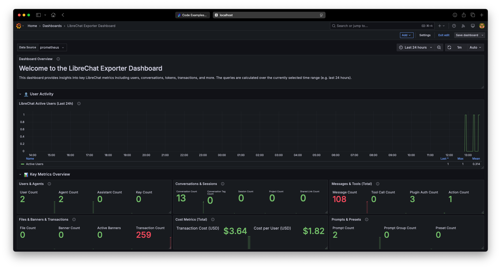
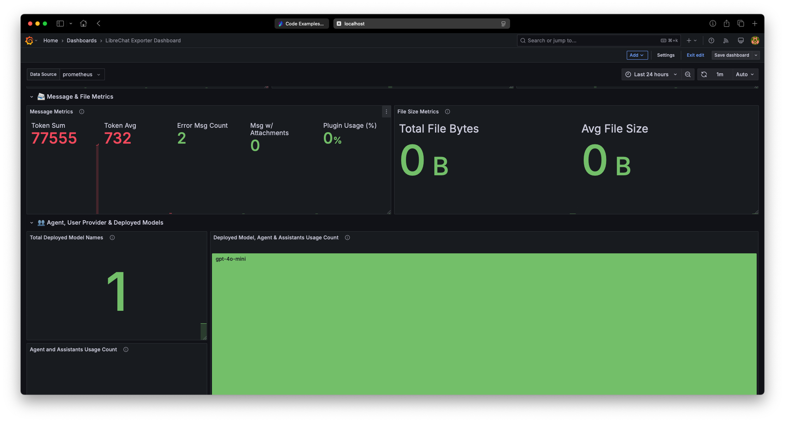
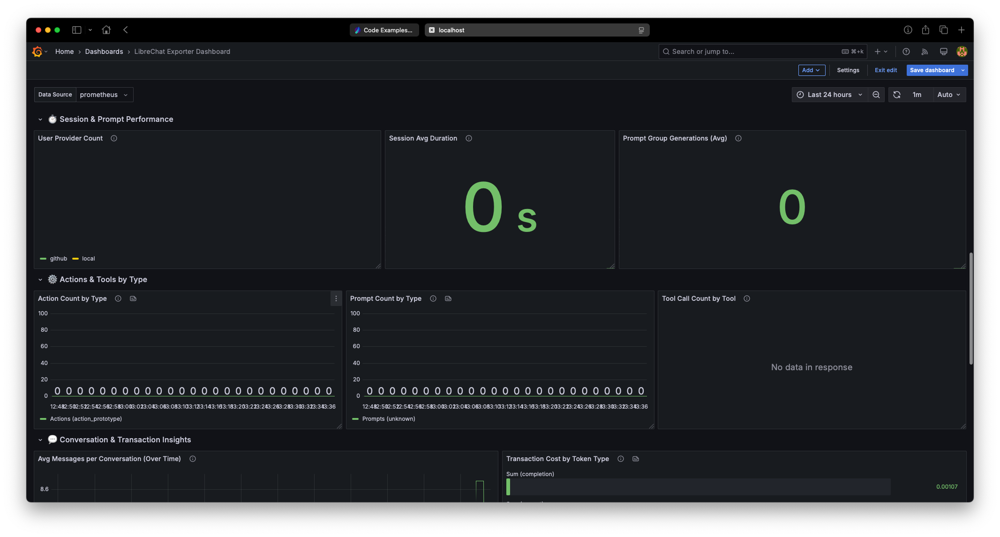
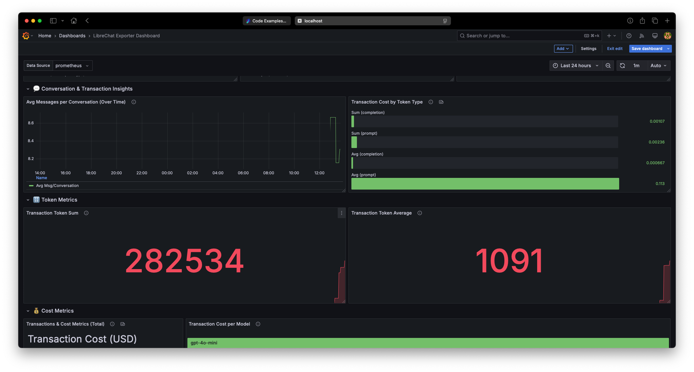
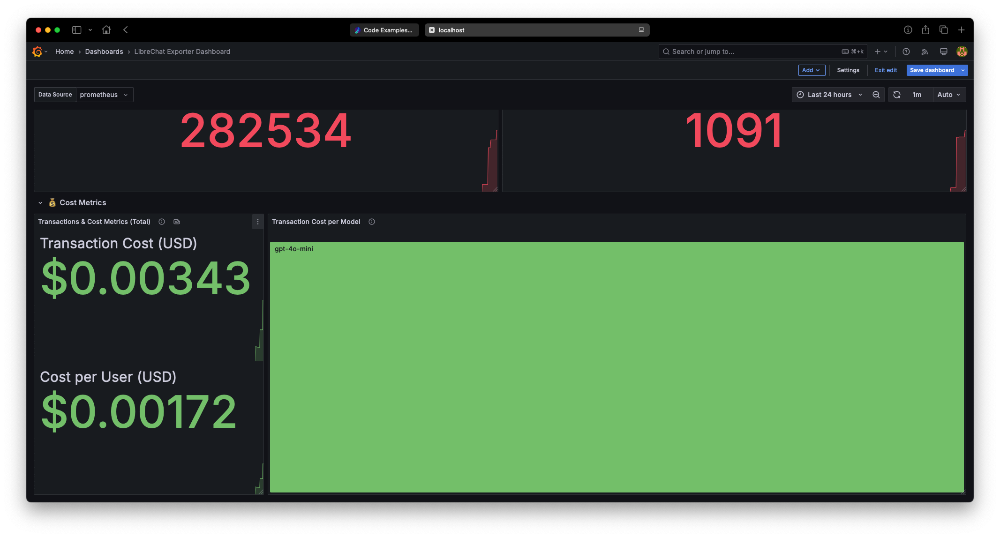

# LibreChat Prometheus Exporter

Welcome to the **LibreChat Prometheus Exporter** repository! This project provides a lightweight Node.js service (built with **Express**, **Mongoose**, and **prom-client**) that connects to your LibreChat MongoDB database, collects useful metrics, and exposes them on a `/metrics` endpoint. You can then configure **Prometheus** to scrape these metrics and visualize them using tools like **Grafana**.

## Table of Contents

1. [Features](#features)
2. [Prerequisites](#prerequisites)
3. [Installation & Setup](#installation--setup)
   - [Local Setup](#local-setup)
   - [Docker Setup](#docker-setup)
4. [Environment Variables](#environment-variables)
5. [Usage](#usage)
6. [Prometheus & Grafana Configuration](#prometheus--grafana-configuration)
7. [Dashboard Example](#dashboard-example)
8. [Dashboard Screenshots](#dashboard-screenshots)
9. [Tuning](#tuning)
10. [Troubleshooting](#troubleshooting)
11. [Project Structure](#project-structure)
12. [Contributing](#contributing)
13. [License](#license)

**GDPR Compliance Statement:**  
This project has been developed with privacy in mind. It only exposes aggregated metrics that do not contain any personally identifiable information (PII), adhering to the principle of data minimization. As a result, this project is designed to be consistent with the requirements of the General Data Protection Regulation (GDPR). However, since overall GDPR compliance depends on the complete data processing workflow and deployment configuration, users are responsible for ensuring that their implementation meets all applicable data protection regulations. This statement is provided for informational purposes only and does not constitute legal advice.

## Features

- **Basic Metrics**: Collects counts of users, messages, conversations, tools, and more from the LibreChat MongoDB database.
- **Advanced Metrics**: Tracks average token usage, error messages, plugin usage, file size stats, transaction costs, cost per user/model, agent usage, session duration, and more.
- **Prometheus Integration**: Exposes a `/metrics` endpoint that Prometheus can scrape.
- **Grafana Dashboard**: Provides an example dashboard configuration (JSON) for visualizing metrics (see [Dashboard Example](#dashboard-example)).

## Prerequisites

1. **Node.js** 24.x or later (25.x recommended; see `.nvmrc`)
2. **MongoDB 7+** (LibreChat's default docker-compose ships `mongo:8.0`. Older Mongo versions silently emit `0` for the percentile metrics `librechat_conversation_length_p{50,90,95}` and `librechat_file_size_p{50,95}_bytes` — `$percentile` is a 7.0+ operator.)
3. **Docker** (optional but recommended for running in a container)
4. **Prometheus** (for metric scraping)
5. **Grafana** (for visualization, optional but highly recommended)

## Installation & Setup

You can run the exporter either locally using Node.js or inside a Docker container. Below are the instructions for both methods.

### Local Setup

1. **Clone the repository**:
   ```bash
   git clone https://github.com/rubentalstra/librechat-prom-exporter.git
   cd librechat-prom-exporter
   ```

2. **Install dependencies**:
   ```bash
   npm install
   ```

3. **Set environment variables**:  
   An example file `.env.example` is provided in the project root. Copy this file to a new `.env` file and update it with your specific settings:
   ```bash
   cp .env.example .env
   ```
   Alternatively, set the environment variables in your shell (see the [Environment Variables](#environment-variables) section).

4. **Build the project**:
   ```bash
   npm run build
   ```

5. **Run the exporter**:
   ```bash
   npm run start
   ```
   The exporter should now be running on the configured port (default `9087`).

### Docker Setup

This setup uses the prebuilt **LibreChat Prometheus Exporter** image from GitHub Container Registry, so there’s no need to build the container locally.

1. **Set environment variables**:  
   Copy `.env.example` to `.env` in the same directory as the `docker-compose.yml`:
   ```bash
   cp .env.example .env
   ```

2. **Run Docker Compose**:
   ```bash
   docker-compose up -d
   ```
   - This will pull the latest `ghcr.io/rubentalstra/librechat-prom-exporter:latest` image for the exporter service.
   - It will also spin up a Prometheus container based on the configuration in `docker-compose.yml`.

3. The exporter container should now be exposing metrics on `http://localhost:9087/metrics` (or your chosen port).

## Environment Variables

The following environment variables can be configured via the `.env` file (or your shell environment). Use the provided `.env.example` as a starting point.

| Variable                         | Default                                          | Description                                                                                                                                                                                                                                                    |
|----------------------------------|--------------------------------------------------|----------------------------------------------------------------------------------------------------------------------------------------------------------------------------------------------------------------------------------------------------------------|
| `MONGO_URI`                      | `mongodb://host.docker.internal:27017/librechat` | The connection string for your LibreChat MongoDB database.                                                                                                                                                                                                     |
| `PORT`                           | `9087`                                           | The port on which the exporter will run and expose `/metrics`.                                                                                                                                                                                                 |
| `REFRESH_INTERVAL`               | `30000`                                          | Interval in ms for the basic metrics scrape (cheap, runs often).                                                                                                                                                                                               |
| `ADVANCED_REFRESH_INTERVAL`      | `REFRESH_INTERVAL × 10`                          | Interval in ms for the advanced metrics scrape (heavy, runs separately so a slow advanced cycle doesn't block basic).                                                                                                                                          |
| `MONGO_POOL_SIZE`                | `50`                                             | `maxPoolSize` passed to `mongoose.connect`.                                                                                                                                                                                                                    |
| `LOG_TIMINGS`                    | `false`                                          | When `true`, prints per-scrape and per-section timing lines to stdout. Per-section durations are also exposed as the `librechat_exporter_section_duration_seconds` histogram regardless of this flag. Accepts `true` or `false` (case-insensitive). |
| `EMIT_PER_USER_METRICS`          | `false`                                          | When `true`, emits the three high-cardinality `email`-labeled metrics (see [Cardinality](#cardinality) below). Default off to protect large deployments.                                                                                                       |
| `TENANT_ID`                      | _(unset)_                                        | When set, installs mongoose schema hooks that scope every aggregate / find / count query to the named tenant. Leave unset on single-tenant LibreChat installs (the default).                                                                                   |
| `METRICS_PORT`                   | _(unset)_                                        | Optional second port for `/metrics` only. If set and different from `PORT`, `/metrics` binds there and `/health` stays on `PORT`. Useful for k8s sidecar / internal-only metrics scraping.                                                                     |
| `TRUST_PROXY`                    | `loopback`                                       | Value passed to `app.set('trust proxy', ...)`. Set when running behind a reverse proxy so `req.ip` / IP allowlist see real clients. Accepts `true`, `false`, CIDR list, or `loopback`/`linklocal`/`uniquelocal`.                                               |
| `RATE_LIMIT_WINDOW_MS`           | `60000`                                          | Per-IP rate limit window in ms.                                                                                                                                                                                                                                |
| `RATE_LIMIT_MAX`                 | `120`                                            | Max requests per IP to `/metrics` per window.                                                                                                                                                                                                                  |
| `HEALTH_RATE_LIMIT_MAX`          | `600`                                            | Max requests per IP to `/health` per window.                                                                                                                                                                                                                   |
| `METRICS_BEARER_TOKEN`           | _(unset)_                                        | If set, `/metrics` requires `Authorization: Bearer <token>`. See [Auth](#auth-on-metrics).                                                                                                                                                                     |
| `METRICS_BASIC_AUTH_USER`        | _(unset)_                                        | HTTP Basic username. Must be set together with `METRICS_BASIC_AUTH_PASSWORD`.                                                                                                                                                                                  |
| `METRICS_BASIC_AUTH_PASSWORD`    | _(unset)_                                        | HTTP Basic password.                                                                                                                                                                                                                                           |
| `METRICS_OAUTH2_ISSUER`          | _(unset)_                                        | OIDC issuer URL. Exporter discovers JWKS from `${issuer}/.well-known/openid-configuration` at boot. Mutually exclusive with `METRICS_OAUTH2_JWKS_URI`.                                                                                                         |
| `METRICS_OAUTH2_JWKS_URI`        | _(unset)_                                        | Direct JWKS endpoint URL. Use when the IdP does not expose OIDC discovery.                                                                                                                                                                                     |
| `METRICS_OAUTH2_AUDIENCE`        | _(unset)_                                        | Required if any `METRICS_OAUTH2_*` is set. The `aud` claim the exporter accepts.                                                                                                                                                                               |
| `METRICS_OAUTH2_REQUIRED_SCOPES` | _(unset)_                                        | Space-separated scopes. Token must carry every listed scope in `scope` or `scp`.                                                                                                                                                                               |
| `METRICS_OAUTH2_ALGORITHMS`      | `RS256,ES256`                                    | Comma-separated allowed JWT signing algorithms.                                                                                                                                                                                                                |
| `METRICS_ALLOWED_IPS`            | _(unset)_                                        | Comma-separated CIDRs (IPv4 / IPv6). Requests outside the list are rejected with 403. Combine with a token method (both must pass) or use standalone.                                                                                                          |
| `METRICS_AUTH_LOG_REJECTS`       | `true`                                           | Log auth rejections (rate-limited to ~1/sec). Set to `false` to silence.                                                                                                                                                                                       |

Example `.env` file (generated by copying `.env.example`):
```
MONGO_URI=mongodb://my-mongo-host:27017/librechat
PORT=9087
```

[//]: # (> [!WARNING])
### Cardinality

Three metrics carry an `email` label and emit one Prometheus series per user. On large deployments this grows unbounded, so they are gated behind `EMIT_PER_USER_METRICS=true`:

- `librechat_transaction_cost_by_user{email}`
- `librechat_transaction_token_sum_by_model_user{model,tokenType,email}`
- `librechat_agent_usage_by_user_count{agent,email}`

The corresponding `*_by_email_domain` variants are bounded by company domains and remain enabled by default.

### Auth on `/metrics`

`/metrics` is **publicly accessible by default**. The exporter ships with four optional auth methods that can be enabled via environment variables. Any combination is supported; the IP allowlist (if set) is enforced in addition to whichever token method authorizes the request.

| Method              | Enable with                                                            | Prometheus / Alloy scrape side                            |
|---------------------|------------------------------------------------------------------------|-----------------------------------------------------------|
| Static bearer token | `METRICS_BEARER_TOKEN`                                                 | `authorization: { type: Bearer, credentials: <token> }`   |
| HTTP Basic          | `METRICS_BASIC_AUTH_USER` + `METRICS_BASIC_AUTH_PASSWORD`              | `basic_auth: { username, password }`                      |
| OAuth2 / OIDC JWT   | `METRICS_OAUTH2_{ISSUER,JWKS_URI,AUDIENCE,REQUIRED_SCOPES,ALGORITHMS}` | `oauth2: { client_id, client_secret, token_url, scopes }` |
| IP allowlist        | `METRICS_ALLOWED_IPS` (comma-separated CIDRs)                          | _(network-layer; no scrape-side config)_                  |

**Which method should I pick?**

- **Static bearer token** — simplest; one secret, no IdP needed. Fine for small deployments and CI scrapers.
- **HTTP Basic** — compatible with older Prometheus setups that prefer `basic_auth`. Behavior is equivalent to static bearer.
- **OAuth2 / OIDC** — best for enterprise setups with an IdP (Keycloak, Auth0, Okta, Azure AD). Tokens rotate, scopes are enforced, secrets never leave the IdP. The exporter validates the JWT against the issuer's JWKS (cached for 10 min, with automatic key rotation).
- **IP allowlist** — defense in depth. Pair with a token method to require both network and credential checks, or use standalone when network isolation is your only requirement.

If none of the four env vars is set, `/metrics` stays open (current behavior, no breaking change).

**Prometheus scrape examples**

Static bearer:

```yaml
scrape_configs:
  - job_name: 'librechat-exporter'
    authorization:
      type: Bearer
      credentials: "your-shared-secret"
    static_configs:
      - targets: ['exporter:9087']
```

Basic auth:

```yaml
scrape_configs:
  - job_name: 'librechat-exporter'
    basic_auth:
      username: prom
      password: "your-password"
    static_configs:
      - targets: ['exporter:9087']
```

OAuth2 (client_credentials against your IdP):

```yaml
scrape_configs:
  - job_name: 'librechat-exporter'
    oauth2:
      client_id: "prometheus"
      client_secret: "your-client-secret"
      token_url: "https://idp.example.com/realms/main/protocol/openid-connect/token"
      scopes: ["metrics:read"]
    static_configs:
      - targets: ['exporter:9087']
```

The exporter side is then configured with:

```bash
METRICS_OAUTH2_ISSUER=https://idp.example.com/realms/main
METRICS_OAUTH2_AUDIENCE=librechat-prom-exporter
METRICS_OAUTH2_REQUIRED_SCOPES=metrics:read
```

**Grafana Alloy** uses the same primitives in its `prometheus.scrape` component (`basic_auth`, `authorization`, `oauth2` blocks). See the [Alloy `prometheus.scrape` reference](https://grafana.com/docs/alloy/latest/reference/components/prometheus/prometheus.scrape/) and the [Prometheus `scrape_config` reference](https://prometheus.io/docs/prometheus/latest/configuration/configuration/#scrape_config).

When running behind a reverse proxy, also set `TRUST_PROXY=true` (or a CIDR list) so the IP allowlist and rate limiter see real client IPs instead of the proxy.

## Usage

Once running, the service will connect to your LibreChat MongoDB database, gather metrics, and expose them on:

```
GET /metrics
```

Point your Prometheus server to scrape this endpoint at regular intervals (e.g., every 15s or 30s). For example, in your `prometheus.yml`:

```yaml
global:
   scrape_interval: 15s

scrape_configs:
   - job_name: 'librechat-exporter'
     static_configs:
        - targets: ['exporter:9087']
```

## Prometheus & Grafana Configuration

1. **Prometheus**:
   - Ensure your `prometheus.yml` includes the `scrape_configs` pointing to the exporter.
   - Example:
     ```yaml
     global:
         scrape_interval: 15s
     
     scrape_configs:
         - job_name: 'librechat-exporter'
           static_configs:
               - targets: ['exporter:9087']
     ```

2. **Grafana**:
   - Create a new dashboard or import the provided JSON file (`librechat-exporter-dashboard.json`) found in the repository.
   - Set the data source to your Prometheus instance.
   - You will then see panels for user counts, message stats, transaction costs, and more.

## Dashboard Example

The repository contains a sample **Grafana Dashboard** JSON (`librechat-exporter-dashboard.json`) which includes:

- **User Activity** (active users, user provider distribution)
- **Key Metrics Overview** (counts for users, messages, conversations, etc.)
- **Message & File Metrics** (token usage, plugin usage, file sizes)
- **Session & Prompt Performance** (average session duration, prompt group generations)
- **Actions & Tools by Type** (bar charts for action and prompt counts, tool call usage)
- **Conversation & Transaction Insights** (average messages per conversation, transaction cost breakdown, token sums)

Import this file directly into Grafana to get a comprehensive overview of your LibreChat metrics.

## Dashboard Screenshots

Below are sample screenshots from the **LibreChat Exporter Dashboard**. These images (screenshots 1-5) illustrate various panels and insights provided by the dashboard.

1. **Dashboard Overview**  
   
   
   
   
   

---

## Tuning

A few knobs worth thinking about before turning on the exporter at scale:

- **`MONGO_POOL_SIZE`** (default `50`) — sets `maxPoolSize` on the mongoose connection. The advanced scrape fans many aggregations out in parallel via `Promise.all`; if you see queries serialize on small deployments, the pool is the first place to look. Most LibreChat installs are fine at the default.
- **`ADVANCED_REFRESH_INTERVAL`** (default `REFRESH_INTERVAL × 10`, i.e. 300s) — the heavy `$facet` aggregations run at this cadence. On very large message/transaction collections you may want this longer (e.g. `600000` for 10-minute granularity) to reduce Mongo load. The basic counts continue to refresh on `REFRESH_INTERVAL`.
- **`REFRESH_INTERVAL`** (default `30000`) — cheap `countDocuments` per collection. Going much lower than 10s is usually wasted load; Prometheus typically scrapes every 15–30s anyway.
- **`EMIT_PER_USER_METRICS=true`** — only enable on small / single-tenant deployments. Three metrics gain an `email` label and emit one Prometheus time series per user (unbounded growth). The `*_by_email_domain` variants stay enabled regardless and are bounded by company domain count.
- **`TENANT_ID`** — when set, installs schema-level mongoose hooks that inject `{ $match: { tenantId } }` into every aggregate / find / count. Use this when one MongoDB serves multiple LibreChat tenants and you want metrics scoped to one of them.

Reentrancy: each tier (basic / advanced) holds a per-tier "running" flag and **skips a tick if the previous one is still in flight**. You will see a warn log on each skipped tick (`basic scrape still running, skipping this tick`); these are informational, not errors. Persistent skipping means the scrape budget is too tight — either raise `ADVANCED_REFRESH_INTERVAL` or look at index coverage (`librechat_exporter_missing_indexes`).

## Troubleshooting

- **Percentile gauges (`librechat_conversation_length_p{50,90,95}`, `librechat_file_size_p{50,95}_bytes`) all report `0`.**
  These metrics rely on Mongo's `$percentile` aggregation operator, which was added in **Mongo 7.0**. On Mongo < 7 the operator returns no result and the exporter sets the gauges to 0. Upgrade to Mongo 7.0+ (LibreChat's default `docker-compose.yml` ships `mongo:8.0`).

- **Missing-index warnings on startup / `librechat_exporter_missing_indexes` non-zero.**
  Each missing recommended index is logged once after Mongo connect and exposed as a label set on the `librechat_exporter_missing_indexes` gauge. Create the index using the `createIndex` snippet from the log message — they materially affect advanced-scrape duration on large collections.

- **`/health` flapping between 200 and 503.**
  The exporter forces `serverSelectionTimeoutMS=5s` (vs. mongoose's 30s default) so `/health` flips fast during an outage. If you see oscillation, the underlying Mongo is unstable — check the Mongo logs and connection limits.

- **`/metrics` returns `401` despite a token being set.**
  Confirm the request hits the exporter directly, not via a proxy that strips `Authorization`. When behind a reverse proxy, also set `TRUST_PROXY` to a value matching your proxy topology so the rate limiter and IP allowlist see the original client IP.

- **CD pipeline blocked on Trivy.**
  The CD workflow scans the built image and fails on CRITICAL/HIGH vulnerabilities with a fix available. Update the affected dependency (Dependabot opens weekly PRs) or, if the finding is a false-positive, suppress it via `.trivyignore` with a justification.

## Project Structure

```
librechat-prom-exporter/
├── src/
│   ├── metrics/                
│   │   ├── advancedMetrics.ts  # Contains advanced metric calculations (e.g., token averages, transaction costs, etc.)
│   │   ├── basicMetrics.ts     # Basic metrics collection logic (e.g., counts for users, messages, conversations)
│   │   └── index.ts            # Exports and orchestrates metric updates from basic and advanced modules
│   ├── models/                 # Mongoose models (User, Message, Conversation, etc.)
│   ├── index.ts                # Express app setup and the /metrics endpoint
├── dist/                       # Compiled JavaScript output (generated by `npm run build`)
├── Dockerfile                  # (Optional) Docker build instructions for the exporter service
├── docker-compose.yml          # Docker Compose file for running the exporter (and optionally Prometheus) as containers
├── prometheus.yml              # Sample Prometheus configuration file
├── package.json                
├── tsconfig.json               
├── .env.example                # Example environment variables file
└── README.md                   
```


## Contributing

Contributions are welcome! Feel free to open an issue or submit a pull request if you have improvements, bug fixes, or new feature ideas.

Steps to contribute:
1. Fork the repository.
2. Create a new branch with your feature or fix.
3. Submit a pull request describing your changes.


## License

This project is available under the [MIT License](LICENSE). Feel free to modify and integrate it into your own setups.
