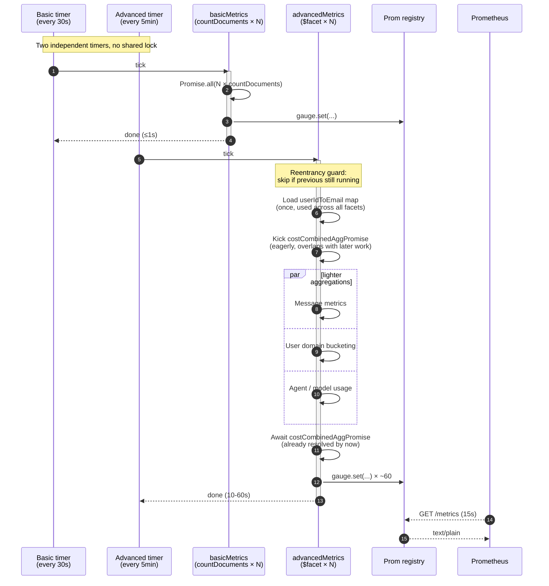
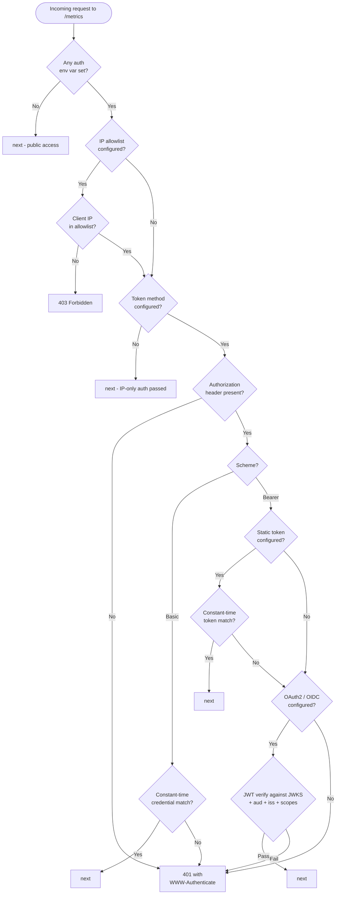

# Architecture

This page is required reading before any non-trivial code change. Most code patterns here exist for a specific reason — usually performance on real-world LibreChat installs with millions of messages.

## Overview

The exporter is a **single-process Express + Mongoose server** (`src/index.ts`) that scrapes a LibreChat MongoDB on two independent timers and exposes the result on `/metrics`. It owns no schemas — all Mongoose models come from `@librechat/data-schemas` via `createModels(mongoose)` in `src/models/index.ts`.

```
src/
├── index.ts               # Express server, two timers, graceful shutdown
├── config.ts              # zod env schema, fail-fast at boot
├── logger.ts              # pino singleton (JSON in prod, pretty in dev)
├── models/index.ts        # Re-exports models from @librechat/data-schemas
├── middleware/
│   └── metricsAuth.ts     # Optional auth: bearer / basic / OAuth2 / IP allowlist
└── metrics/
    ├── index.ts           # Orchestrates timed scrapes; reentrancy guards
    ├── basicMetrics.ts    # ~20 countDocuments per collection
    ├── advancedMetrics.ts # ~60 metrics via $facet aggregations
    ├── tenantHooks.ts     # Optional schema-level tenant scoping
    ├── indexAssertions.ts # Warns on missing recommended Mongo indexes
    └── util.ts            # extractEmailDomain helper
```

## Two-tier scrape

The exporter runs two independent scrape loops at different cadences:

- **Basic** (`src/metrics/basicMetrics.ts`) — cheap `countDocuments` per collection, on `REFRESH_INTERVAL` (default 30 s).
- **Advanced** (`src/metrics/advancedMetrics.ts`) — heavy `$facet` aggregations, on `ADVANCED_REFRESH_INTERVAL` (default `REFRESH_INTERVAL × 10`, i.e. 5 min).

They run on **separate** `setInterval`s so a slow advanced cycle never blocks basic.

`src/metrics/index.ts` wraps each with `updateBasicMetricsTimed` / `updateAdvancedMetricsTimed`, which:

- Hold a per-tier `basicRunning` / `advancedRunning` boolean as a **reentrancy guard** (skips the tick if the previous one is still in flight).
- Record duration into `librechat_exporter_scrape_duration_seconds{metric_group=...}` and bump `librechat_exporter_scrape_errors_total` on throw.
- `waitForIdle()` is used by the shutdown handler to drain in-flight scrapes before disconnecting Mongo.



## In-JS joins instead of `$lookup`

Two maps are built early in the advanced scrape and reused across later aggregations:

- `userIdToEmail` — from `User.find({}, { email: 1 })` at `advancedMetrics.ts:694–701`.
- `convIdToAgentId` — from `Conversation.find({ agent_id: { $exists: true, $ne: null } }, ...)` at `advancedMetrics.ts:709–715`.

This was a deliberate optimization — re-running `$lookup` against `users` or `conversations` inside every aggregation was the bottleneck. **Prefer this pattern when adding metrics that need user-email or conversation-agent context.** Six existing `$lookup`s were rewritten to use the maps in PR #206; that pattern is now the standard.

## Eager-kickoff promise pattern

The Transactions `$facet` (`costCombinedAggPromise`) is started **before** the lighter aggregations and awaited later in both the Token-usage and Cost sections. This lets the heavy query overlap with cheaper work.

:::warning[Don't await it at the kickoff site]
A common bug when adding metrics: accidentally `await`ing `costCombinedAggPromise` immediately. That defeats the overlap. Capture the promise, then await it where the result is consumed.
:::

## `allowDiskUse: true`

The biggest `$facet`s pass `{ allowDiskUse: true }` because they exceed Mongo's 100 MB in-memory aggregation limit on real-world LibreChat installs. **Keep this on for any new pipeline that fans out via `$facet` or groups across the full Transactions/Messages collection.**

## Section timing inside advanced

`updateAdvancedMetrics` walks through ~40 marked "sections" and calls a local `__mark(label)` between them. Each mark observes `librechat_exporter_section_duration_seconds{section=...}`.

The label is **stripped of trailing parentheticals** via regex (e.g. `"User map loaded (1020 users)"` → `"User map loaded"`) to prevent dynamic counts from blowing up histogram cardinality. **If you add a new section label, keep variable parts inside `(...)`** so they get stripped.

## Cardinality gates

Two env flags exist specifically to control Prometheus series count:

- **`EMIT_PER_USER_METRICS=true`** enables three `email`-labeled gauges (one series per user — unbounded). Default off. The `*_by_email_domain` variants are bounded by company domains and stay on.
- **`TENANT_ID=<id>`** installs schema-level pre-hooks (`src/metrics/tenantHooks.ts`) that inject `{ $match: { tenantId } }` into every `aggregate`, `find*`, and `count*` for every model. **Caveat:** `estimatedDocumentCount()` is tenant-blind by design (collection metadata, accepts no filter). The exporter avoids it; if you need a count, use `countDocuments({})` so tenant hooks apply.

When you add a new metric that includes a user-level label, decide up front whether it goes behind `EMIT_PER_USER_METRICS` (per-user) or stays default-on (per-domain only). See [Adding a metric → Cardinality budget](./adding-a-metric#cardinality-budget) for the decision rule.

## Index assertions

`src/metrics/indexAssertions.ts` runs once after Mongo connect. Each missing recommended index is logged and exposed as `librechat_exporter_missing_indexes{collection,key}=1`. **Add a new entry here when you introduce a query that scans a large collection** — saves real ops people real time.

## Auth middleware decision tree

The `metricsAuth` middleware in `src/middleware/metricsAuth.ts` handles four optional methods, evaluated in this order:



Constant-time comparison is via `crypto.timingSafeEqual` to defeat timing oracles. JWKS verification uses `jose.createRemoteJWKSet` with 10-min caching + automatic key rotation. Reject logging is rate-limited to ~1/sec to prevent log floods under brute-force.

## ESM and NodeNext gotchas

- **`"type": "module"`** in `package.json` + **`"module": "NodeNext"`** in tsconfig.
- **All relative imports in `.ts` source must end in `.js`** (e.g. `from "./metrics/util.js"`). NodeNext requires the emitted-extension form even in source. Imports without `.js` will compile but fail at runtime.
- Top-level `await` is fine. The entrypoint uses fire-and-forget `mongoose.connect().then(...)` rather than awaiting it.

## Lint rules worth knowing

`eslint.config.mjs` enforces (as errors, not warnings):

- `max-len: 120`
- `curly: all`
- `semi: always`
- `comma-dangle: always-multiline`
- `object-curly-spacing: always`
- `no-multiple-empty-lines: 1`
- `no-console: error` (use `logger().*` instead)
- `import/order` (alphabetized groups)

`@typescript-eslint/no-explicit-any` and `no-unused-expressions` are intentionally **off** for `.ts` files because Mongoose aggregation result shapes don't always have a clean type.

## Operational config

- **MongoDB 7+ required.** Percentile gauges silently emit 0 on older Mongo because they use the `$percentile` operator.
- **`/health`** returns 200 only when `mongoose.connection.readyState === 1`; 503 otherwise. `serverSelectionTimeoutMS` is forced to 5 s (vs. mongoose default 30 s) so `/health` flips fast during an outage.
- **Graceful shutdown** on SIGTERM/SIGINT: clears timers, closes the HTTP server, `waitForIdle()`s in-flight scrapes, then `mongoose.disconnect()`.
